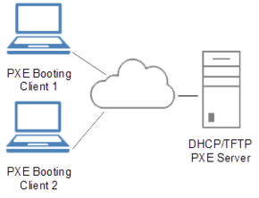
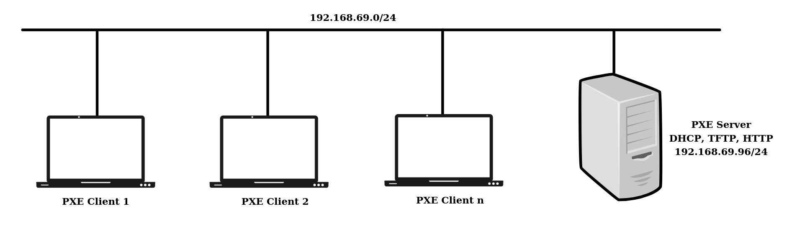
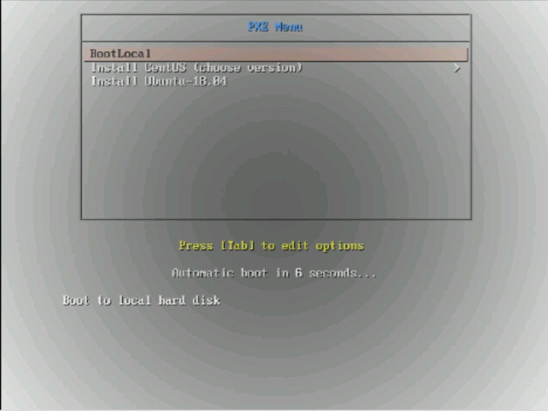

# PXE + Kickstart
Simple provisioning project: PXE+Kickstart (dhcp, tftp, http), to help you understand about the PXE+Kickstart system
# 1.PXE
## 1.1. What is PXE?
\- Preboot Execution Environment - **PXE Server** – instructs a **client** computer to boot, run or install an operating system directly form a network and uses a small set of Extensible Firmware Interface industry-standard network protocols such as DHCP and TFTP.

\- PXE is the most frequent choice for operating system booting, installation and deployment.

<p align="center">
  
</p>
  
\- PXE Server: A system running a DHCP server, a TFTP server, and an HTTP, HTTPS, FTP, or NFS server. While each server can run on a different physical system.

\- Client: The system to which you are installing OS. Once installation starts, the client queries the DHCP server, receives the boot files from the TFTP server, and downloads the installation image from the HTTP, HTTPS, FTP or NFS server. Unlike other installation methods, the client does not require any physical boot media for the installation to start.
  
## 1.2. PXE workflow

1. The user boots the target client host.
2. The client host makes a DHCP request.
3. The DHCP server responds with the IP information, the location of the TFTP or HTTP server, and the filename or URL of the initial network boot loader.
4. The client host contacts the TFTP or HTTP server and requests the filename or URL that the DHCP server specified.
5. The TFTP or HTTP server sends the network boot loader, and the client host runs it. The initial boot loader might load additional boot loader components from the server.
6. The boot loader searches for a configuration file on the TFTP or HTTP server, downloads the kernel and other components as specified in the configuration file, and boots the kernel on the client host.
7. The installer runs interactively or using a kickstart script, as specified in the configuration file.

## 1.3. Syslinux
\- SYSLINUX is a **boot loader** for the Linux operating system which runs on an MS-DOS/Windows FAT filesystem. It is intended to simplify first-time installation of Linux, and for creation of rescue and other special purpose boot disks.

\- When properly configured, SYSLINUX can be used to completely eliminate the need for distribution of raw boot floppy images. A SYSLINUX floppy can be manipulated using standard MS-DOS (or any OS capable of accessing an MS-DOS filesystem) tools once it has been created.

Find more at [Syslinux project](https://wiki.syslinux.org/wiki/index.php?title=The_Syslinux_Project)

# 2. Kickstart
\- Kickstart is a function that gives you the ability to install a complete operating system based on a predefined list (kickstart file).

\- A kickstart file is a simple text file that contains configuration information for a Linux installation. The system reads this configuration information at boot time and carries out the installation process without any further input from you. You can also use a kickstart file to upgrade your system to a new release.

\- Kickstart installations can be performed using a local DVD, a local hard drive, or a NFS, FTP, HTTP, or HTTPS server (This project use HTTP).

\- To use Kickstart, follow by steps:
1. Create a Kickstart file.
2. Make the Kickstart file available on removable media, a hard drive or a network location.
3. Create boot media, which will be used to begin the installation.
4. Make the installation source available.
5. Start the Kickstart installation.

# 3. Lab PXE + Kickstart
## 3.1. Overview



Installing and configuration DHCP, TFTP and HTTP services and Dockerize all services.
Here's an overview of the directory structure:
```
.
├── dhcp
│   ├── dhcpd_config
│   │   └── dhcpd.conf
│   └── Dockerfile
├── docker-compose.yml
├── http
│   ├── boot_data
│   │   ├── kickstart # containing some of kickstart files sample
│   │   │   ├── centos7-9-minimal.cfg
│   │   │   ├── centos7-9-minimal-lvm.cfg
│   │   │   ├── centos7-9-minimal-raid.cfg
│   │   │   ├── centos7-9-minimal-raid-lvm.cfg
│   │   │   ├── centos8-4.cfg
│   │   │   └── ubuntu18-04.cfg
│   │   └── OS # containing installation sources sample
│   │       ├── CentOS-7.9
│   │       │   └── iso-contents-root
│   │       ├── CentOS-8.4
│   │       │   └── iso-contents-root
│   │       └── Ubuntu-18.04
│   │           ├── iso-contents-root
│   │           └── netboot
│   ├── Dockerfile
│   └── logs
│       ├── access.log
│       └── error.log
├── images
│   ├── Lab-PXE-Kickstart.jpg
│   ├── PXE_diagram.png
│   ├── Result1.jpg
│   └── Result2.jpg
└── tftp
    ├── bios # for BIOS-clients configuration
    │   ├── boot
    │   │   ├── CentOS
    │   │   └── Ubuntu18.04
    │   └── pxelinux.cfg
    │       ├── 01-00-50-56-94-62-15
    │       └── default
    ├── Dockerfile
    └── efi # for UEFI-clients configuration

```

## 3.2. Configuration
Making Kickstart files and Installation sources available to the installation program.
### 3.2.1. DHCP
Configure your DHCP server to use the boot images packaged with SYSLINUX. The configuration in the /etc/dhcp/dhcpd.conf file:
```
option space pxelinux;
        option pxelinux.magic code 208 = string;
        option pxelinux.configfile code 209 = text;
        option pxelinux.pathprefix code 210 = text;
        option pxelinux.reboottime code 211 = unsigned integer 32;
        option architecture-type code 93 = unsigned integer 16;

        option domain-name-servers 192.168.69.96;

        
        subnet 192.168.69.0 netmask 255.255.255.0 {
            option routers 192.168.69.96;
            range 192.168.69.99 192.168.69.253;
        
            class "pxeclients" {
            match if substring (option vendor-class-identifier, 0, 9) = "PXEClient";
            next-server 192.168.69.96; #TFTP server
        
            if option architecture-type = 00:07 {
                filename "syslinux/efi64/syslinux.efi"; # for UEFI-based clients.
                } else {
                filename "syslinux/lpxelinux.0"; # for BIOS-based clients. Use pxelinux.0 or lpxelinux.0 (supports HTTP transfers). 
             }

            }
        }
```

### 3.2.2. HTTP
\- Installation sources
- Downloads ISO image file of the OS you want to install. Copy the ISO image or the installation tree (extracted contents of the ISO image) to a network location and perform the installation over the network using the HTTP, and make it accessible over HTTP server.
- mount the ISO image, using the mount command, to a suitable directory:

**note**: because we install local REPOSITORY, we need to download full REPOSITORY, ex: DVD or cdimages

```
mount -t iso9660 /path_to_image/name_of_image.iso /mount_point/iso-contents-root -o loop,ro
```
- Copy the files from the mounted image to the HTTP server:
```
cp -r /mount_point/iso-contents-root /http/boot_data/OS/name_of_OS/
```

For Ubuntu, you need to download [Ubuntu netboot here](https://cdimage.ubuntu.com/netboot/). Choosing the version, architecture then download the netboot file ex:
Ubuntu18.04, amd64, netboot.tar.gz, extract the package and cp the kernel and make it available on the HTTP server.
```
tar -xf netboot.tar.gz -C /my_dir
cp /my_dir/ubuntu-installer/amd64/linux /http/boot_data/OS/name_of_ubuntu_OS/netboot
cp /my_dir/ubuntu-installer/amd64/initrd.gz /http/boot_data/OS/name_of_ubuntu_OS/netboot
```

In this Lab i choose: CentOS-7.9 minimal , CentOS-8.4 and Ubuntu-18.04

\- Kickstart files
- Creating a Kickstart by use the file created by a manual installation of CentOS: _/root/anaconda-ks.cfg_, or creating a Kickstart file with the Kickstart configuration tool, using the template or creating by manual (Refer to the [Red Hat documentation](https://docs.centos.org/en-US/8-docs/advanced-install/assembly_kickstart-script-file-format-reference/) for detailed instructions).

sample kickstart file for CentOS7-9 mininal installation
```
# Install OS instead of upgrade
install
# Use network installation
url --url="http://192.168.69.96/OS/CentOS-7.9/iso-contents-root"
# Use graphical install
graphical
# Root password
rootpw 123456
# System authorization information
auth  --useshadow  --passalgo=sha512
user --groups=wheel --name=raid-lvm  --password=123456
# Firewall configuration
firewall --enabled --ssh

# Installation logging level
logging --level=info
# System timezone, language and keyboard
timezone --utc America/Los_Angeles
lang en_US
# Keyboard layouts
keyboard --xlayouts='us'

# Network information
network  --bootproto=dhcp --device=eth0 --onboot=on

# System bootloader configuration
bootloader --location=mbr
# Partition clearing information
zerombr
clearpart --all --initlabel --drives=sda,sdb

# raid lvm config
part raid.11 --size 1000 --asprimary --ondrive=sda
part raid.12 --size 2000 --asprimary --ondrive=sda
part raid.13 --size 3000 --asprimary --ondrive=sda
part raid.14 --size 4000 --ondrive=sda
part raid.15 --size 5000 --ondrive=sda
part raid.16 --size 5000 --grow --ondrive=sda
part raid.21 --size 1000 --asprimary --ondrive=sdb
part raid.22 --size 2000 --asprimary --ondrive=sdb
part raid.23 --size 3000 --asprimary --ondrive=sdb
part raid.24 --size 4000 --ondrive=sdb
part raid.25 --size 5000 --ondrive=sdb
part raid.26 --size 5000 --grow --ondrive=sdb

#raid
raid / --fstype xfs --device root --level=RAID1 raid.11 raid.21
raid /usr --fstype xfs --device usr --level=RAID1 raid.12 raid.22
raid swap --fstype swap --device swap --level=RAID1 raid.13 raid.23
raid /var --fstype xfs --device var --level=RAID1 raid.14 raid.24
raid /home --fstype xfs --device home --level=RAID1 raid.15 raid.25
raid pv.01 --fstype xfs --device pv.01 --level=RAID1 raid.16 raid.26

# LVM configuration so that we can resize /home/data later 
volgroup gv.01 pv.01
logvol /home/data --vgname=gv.01 --size=4000 --name=data

# Reboot after installation
reboot

%packages  --nobase
@core
# @base

%end
```
- Making a Kickstart file available on an HTTP server, copy the Kickstart file to the HTTP server into the /http/boot_data/Kickstart directory.
```
cp /path_to_kickstart_file /http/boot_data/Kickstart
```

### 3.2.3. TFTP
\- Downloads and extract the Syslinux packages [SYSLINUX_PACKAGE](https://dl-cdn.alpinelinux.org/alpine/v3.14/main/x86_64/syslinux-6.04_pre1-r9.apk) (for alpine- 3.14 base image)
```
wget "$SYSLINUX_PACKAGE" -O /tmp/syslinux/syslinux.apk
tar -C /tmp/syslinux -xvf /tmp/syslinux/syslinux.apk
```
\- Create a _/tftpboot_ directory and copy _../syslinux_ directory to _/tftpboot_ directory
```
mkdir -p /tftpboot
cp -r /tmp/syslinux/usr/share/syslinux /tftpboot

```
\- Create a _/tftpboot/syslinux/pxelinux.cfg_ directory and _/tftpboot/syslinux/boot_ directory
```
mkdir -p /tftpboot/syslinux/boot
mkdir -p /tftpboot/syslinux/pxelinux.cfg
```
\- Add a default configuration file to the pxelinux.cfg/ directory, this is _pxelinux.cfg/default_
```
DEFAULT vesamenu.c32 
TIMEOUT 200
ONTIMEOUT BootLocal
PROMPT 0
MENU TITLE PXE-Boot Menu
NOESCAPE 1

LABEL BootLocal
        localboot 0
        TEXT HELP
        Boot to local hard disk
        ENDTEXT

MENU BEGIN CentOS
MENU TITLE Install CentOS (choose version)
        LABEL Previous
        MENU LABEL Previous Menu
        TEXT HELP
        Return to previous menu
        ENDTEXT
        MENU EXIT
        MENU SEPARATOR
        MENU INCLUDE boot/CentOS 
MENU END

label Ubuntu
	MENU INCLUDE boot/Ubuntu18.04

```
\- **Note**: in the _pxelinux.cfg/_ directory,then PXELINUX will try the following configuration files (in this order):
**UUID**, **MAC** address, **IPv4** address (in uppercase hexadecimal) and then the **default** file. So if you want to install specific OS template to a specific client just give the configuration file name by client's UUID, MAC address or IPv4 address.

EX: client UUID "b8945908-d6a6-41a9-611d-74a6ab80b83d", MAC address "00:50:56:94:72:AF" and IPv4 address "192.168.69.196" (in uppercase hexadecimal, "C0A845C4"), the following files will be attempted in this order:
```
 syslinux/pxelinux.cfg/b8945908-d6a6-41a9-611d-74a6ab80b83d
 syslinux/pxelinux.cfg/01-00:50:56:94:72:af
 syslinux/pxelinux.cfg/C0A845C4
 syslinux/pxelinux.cfg/C0A845C
 syslinux/pxelinux.cfg/C0A845
 syslinux/pxelinux.cfg/C0A84
 syslinux/pxelinux.cfg/C0A8
 syslinux/pxelinux.cfg/C0A
 syslinux/pxelinux.cfg/C0
 syslinux/pxelinux.cfg/C
 syslinux/pxelinux.cfg/default
```

\- Add configuration files for specific OS to the _boot/_ directory. Point to the kernel **vmlinuz** , **initrd** and **Kickstart file** they were located at HTTP server configuration above.

For CentOS config:

```
LABEL CentOS-8.4
        MENU LABEL ^Install CentOS-8.4 (64-bit)
        KERNEL http://192.168.69.96/OS/CentOS-8.4/iso-contents-root/images/pxeboot/vmlinuz
        APPEND initrd=http://192.168.69.96/OS/CentOS-8.4/iso-contents-root/images/pxeboot/initrd.img  inst.ks=http://192.168.69.96/kickstart/centos8-4.cfg
        TEXT HELP
        auto install CentOS-8.4 by Kickstart
        ENDTEXT
LABEL CentOS-7.9
        MENU LABEL ^Install CentOS-7.9 (64-bit)
        KERNEL http://192.168.69.96/OS/CentOS-7.9/iso-contents-root/images/pxeboot/vmlinuz
        APPEND initrd=http://192.168.69.96/OS/CentOS-7.9/iso-contents-root/images/pxeboot/initrd.img ks=http://192.168.69.96/kickstart/centos7-9.cfg
        TEXT HELP
        auto install CentOS-7.9 by Kickstart
        ENDTEXT
```

For Ubuntu config:
```
default vesamenu.c32
prompt 1
timeout 200
            
MENU TITLE PXE Menu

LABEL Ubuntu-18.04

	menu label ^Install Ubuntu-18.04
	kernel http://192.168.69.96/OS/Ubuntu-18.04/netboot/linux
        append initrd=http://192.168.69.96/OS/Ubuntu-18.04/netboot/initrd.gz ip=dhcp ks=http://192.168.69.96/kickstart/ubuntu18-04.cfg http_proxy="http://10.90.44.199:3128" https_proxy="http://10.90.44.199:3128" no_proxy="localhost,127.0.0.1,::1,192.168.69.96"

TEXT HELP
Auto install Ubuntu-18.04 by Kickstart
ENDTEXT
```

See my _Dockerfile_ for all services and the _docker-compose.yml_ to be more clear.

That all, start all the services and boot the client - remember choose the boot option to the **Netboot**

See the result:

<p align="center">
  
</p>

**For you**: add boot for the UEFI-based clients
